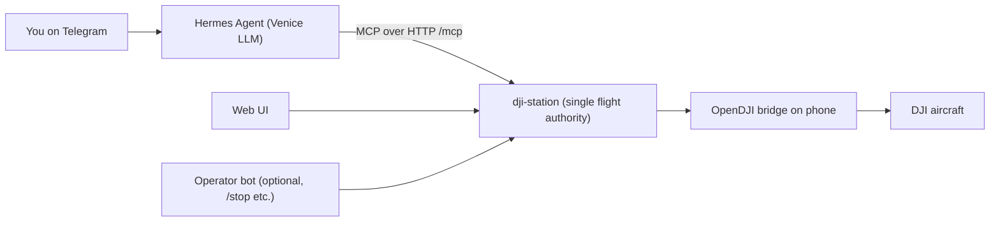

# dji-ground

A local ground station for DJI aircraft. One process gives you a web UI, a REST/WebSocket API,
and an MCP endpoint for a **Hermes Agent** (Venice AI inference, chatting over Telegram). The
operator and the agent can see what the aircraft sees, ask for a description, run a closed set of
flight modes, and live 3D-scan an object ("find item X and 3D model it").

> [!IMPORTANT]
> **The human holding the DJI RC is always pilot in command.** dji-ground does not fly beyond
> visual line of sight (BVLOS). Every autonomous action goes through safety gates, a geofence, and
> a motion token minted by the server.

---

## Quick start (simulator, about 2 minutes)

```bash
git clone https://github.com/maximusmaximus/dji-ground.git
cd dji-ground
uv sync --extra dev            # or: uv venv && uv pip install -e ".[dev]"
cp .env.example .env           # optional for the simulator; needed for Venice/Telegram
uv run dji-station --check     # readiness report with fix hints
uv run dji-station --enable-3d # opens http://localhost:8000
```

`dji-station` starts the following in **one process, with one flight authority**:

| What | Where |
| :--- | :--- |
| Web UI (FPV, HUD, mode selector, 3D viewer + timeline scrubber, gamepad) | `http://localhost:8000/` |
| MCP for Hermes / any MCP client (streamable HTTP) | `http://localhost:8000/mcp` |
| REST health / status | `/api/health`, `/api/status` |
| Live video | `/video/mjpeg` |
| Telemetry WebSocket | `/ws/telemetry` |

### `dji-station` options

| Flag | Effect |
| :--- | :--- |
| `--check` | Only run the readiness checks (exits 1 if anything is FAIL) |
| `--enable-3d` | Turn on the live 3D scanner (same as `DJI_ENABLE_3D_MODELING=true`) |
| `--opendji` | Use the real phone bridge instead of the simulator |
| `--telegram` | Also run the Telegram operator bot in the same process |
| `--port 8000` / `--host 0.0.0.0` | Where to listen |
| `--no-browser` | Don't open the browser |
| `--log-level debug` | Verbose logs |

If the port is busy, the station tells you so and suggests a free one. If the phone bridge is
not connected yet, the station starts in `DISCONNECTED` and retries every 3 s, so you can plug
the phone in afterwards.

---

## Hermes + Venice + Telegram setup

This is the main deployment: a Hermes Agent uses Venice for inference, talks to you on
Telegram, and flies through dji-ground's MCP tools.



### 1. Variables

| Variable | Where | Needed for | How to get it |
| :--- | :--- | :--- | :--- |
| `VENICE_API_KEY` | repo `.env` **and** `~/.hermes/.env` | Scene captions (VLM) + Hermes inference + bot copilot | <https://venice.ai/settings/api> |
| `VENICE_MODEL` | repo `.env` | Text model (default `llama-3.3-70b`) | `GET https://api.venice.ai/api/v1/models` |
| `VENICE_VISION_MODEL` | repo `.env` | Vision model (default `qwen3-vl-235b-a22b`) | Pick a model with `supportsVision: true` |
| `TELEGRAM_BOT_TOKEN` | `~/.hermes/.env` (Hermes bot) and/or repo `.env` (operator bot) | Telegram | [@BotFather](https://t.me/BotFather) |
| `TELEGRAM_ALLOWED_USERS` | same place as the token | Who may command. **Empty = nobody.** | [@userinfobot](https://t.me/userinfobot) |
| `DJI_ENABLE_3D_MODELING` | repo `.env` | 3D scanner tools | `true`, or `--enable-3d` |
| `DJI_BRIDGE_MODE` | repo `.env` | `fake` (simulator) or `opendji` | see "Connecting the aircraft" |
| `DJI_GEOFENCE_FILE` | repo `.env` | Outdoor fence (metres, takeoff = origin) | default `config/geofence_default.json` |
| `DJI_GATEWAY_URL` | repo `.env` | Where a standalone `dji-telegram` reaches the station | default `http://127.0.0.1:8000` |

The full list with comments is in [`.env.example`](.env.example). Values that start with `your_`
count as not set.

### 2. Start the station

```bash
uv run dji-station --enable-3d --no-browser
```

### 3. Point Hermes at it

Merge [`deploy/hermes/config.yaml`](deploy/hermes/config.yaml) into `~/.hermes/config.yaml`:

```yaml
model:
  provider: custom
  base_url: "https://api.venice.ai/api/v1"
  default: "llama-3.3-70b"

mcp_servers:
  dji-ground:
    url: "http://127.0.0.1:8000/mcp"
```

The simplest way to set up the Venice provider is `hermes model`. Choose **Custom endpoint**,
enter base URL `https://api.venice.ai/api/v1`, paste your Venice key, and pick a model. Then:

```bash
mkdir -p ~/.hermes/skills
cp deploy/hermes/SOUL.md ~/.hermes/
cp deploy/hermes/skills/*.md ~/.hermes/skills/
hermes mcp test dji-ground        # should list 24 tools
```

<details>
<summary>Alternative: let Hermes spawn the server over stdio (no web UI)</summary>

```yaml
mcp_servers:
  dji-ground:
    command: "uv"
    args: ["--directory", "/path/to/dji-ground", "run", "dji-ground", "--enable-3d-modeling"]
```

Don't run this alongside `dji-station` against the same aircraft. It creates a second flight
authority.
</details>

### 4. Telegram

- **Hermes on Telegram.** Put `TELEGRAM_BOT_TOKEN` and `TELEGRAM_ALLOWED_USERS` in
  `~/.hermes/.env` and start the Hermes gateway (`hermes gateway`). You then chat with the agent,
  which calls the MCP tools.
- **Operator bot (optional, recommended as a kill switch).** It gives you deterministic commands
  that skip the LLM: `/stop`, `/status`, `/photo`, `/describe`, `/scan`, `/confirm_scan`,
  `/models`, `/download`, `/land`, `/rth`. Run it with `uv run dji-station --telegram`. See
  [`deploy/telegram/README.md`](deploy/telegram/README.md).

> [!WARNING]
> Telegram only lets one process poll a bot token. If you run both Hermes and the operator bot,
> create **two bots** with @BotFather. Otherwise you get `409 Conflict`.

---

## "Find item X and 3D model it"

1. Start with `--enable-3d`, take off, and point the camera at the object.
2. Ask Hermes (or send `/scan chair` on Telegram). `scan_target_object("chair")` finds the object
   and returns `requires_arm` with its bounding box. **Nothing moves.**
3. You, the pilot, approve it: `/confirm_scan chair` on Telegram, or `arm_motion("orbit")` and then
   `scan_target_object("chair", confirm_token=...)`.
4. The aircraft starts one geofenced orbit with the camera yawed toward the object, recording
   keyframes with poses, then hovers. Progress shows in `get_status().mission_progress`.
   (See the watchdog limitation below.)
5. `stop_3d_scan()` exports `.ply`, `.obj`, and `.gltf` to `data/models_3d/`. In the web UI,
   open the 3D viewer to orbit, pan, and zoom, and drag the timeline to scrub through the
   reconstruction. Use `/models` and `/download <id>` on Telegram.

> [!WARNING]
> **Known limitation (design decision pending):** the 500 ms watchdog requires a live client
> heartbeat. Today only takeoff/`set_mode` calls and the web UI gamepad socket
> (`/ws/manual_stick`) refresh it. An autonomous mode started from Hermes or Telegram therefore
> drops to `EMERGENCY_HOVER` about 0.5 s after it is engaged. The scan session still records,
> but the orbit doesn't complete.

3D settings: `DJI_MODEL_3D_RESOLUTION` (high/medium/low), `DJI_MODEL_3D_KEYFRAME_MS`,
`DJI_MODEL_3D_MAX_POINTS`, `DJI_MODEL_3D_EXPORT_DIR`. When the flag is off, the 3D tools return
`3d_modeling_disabled` with instructions instead of failing silently.

---

## Flight modes

| Mode | Translates? | Behaviour |
| :--- | :--- | :--- |
| `narrate` | no | Hover; describe the scene on demand |
| `sentinel` | no | Hover; evaluate triggers and scene diffs against a baseline |
| `follow` | yes | Proportional tracking of a locked bbox; hovers if the target is lost for >1 s |
| `orbit` | yes | One revolution of radius `r` (param `radius`) around a point ahead, facing it, then hover |
| `indoor_grid` | yes | Serpentine lanes (`width`, `depth`, `spacing`) capped at 1 m/s, then hover |
| `outdoor_box` | yes | Square perimeter (`side`) centred on the start point, returns to start, then hover |
| `manual_sidecar` | yes | Your gamepad drives the sticks through `/ws/manual_stick`; vision watches |

Translating modes need `arm_motion(<mode>)` first. Waypoints outside the geofence are dropped
before flight (reported as `dropped_outside_geofence`). Every path ends in a zero-stick hold.

---

## Safety invariants

1. LLMs and VLMs never produce stick values. Triggers use a closed action enum: `notify`, `photo`,
   `hover`, `yaw_toward`, `start_mode`, `rth`, `land`.
2. There is one authority (`dji_ground.authority.Authority`). Hermes, the web UI, and the
   Telegram bot are all clients of it.
3. Takeoff and translating modes need a single-use, short-lived token from `arm_motion()`.
   Invented or expired tokens are rejected, and `scan_target_object` never mints one.
4. A 15 Hz stick loop runs with a **500 ms watchdog** that zeroes sticks and hovers.
5. Video older than 1000 ms forces hover. A placeholder frame is reported as stale, never as live.
6. Caps: indoor 1.0 m/s, 3 m AGL, 15 m box. Outdoor 3.0 m/s, 30 m AGL, polygon geofence.
7. `emergency_stop` and `release_to_rc` always succeed. On bridge loss, sticks zero. On
   reconnect, the aircraft hovers and never resumes a mode automatically.
8. Not allowed: BVLOS, flying by tapping the Android UI, MAVLink.

---

## Connecting the aircraft

**Simulator (default):** `DJI_BRIDGE_MODE=fake`. Physics, telemetry, and an H.264 fixture feed are
built in.

**Phone + RC (live):**

1. Connect the Android phone to the DJI RC over USB and run **OpenDJI**
   ([Penkov-D/DJI-MSDK-to-PC](https://github.com/Penkov-D/DJI-MSDK-to-PC)).
2. `adb forward tcp:8001 tcp:8001 && adb forward tcp:8002 tcp:8002 && adb forward tcp:8003 tcp:8003`
3. Edit `config/geofence_default.json` (or set `DJI_GEOFENCE_FILE`) to fit your flying area.
4. `uv run dji-station --opendji --check`, then `uv run dji-station --opendji --enable-3d`.
5. Keep the aircraft in visual line of sight with your hands on the RC.

**Lab only:** the DJI Android Bridge App in the Android Studio emulator with the DJI Assistant 2
simulator.

---

## Other entry points

| Command | Purpose |
| :--- | :--- |
| `uv run dji-station` | Everything (recommended) |
| `uv run dji-ground [--enable-3d-modeling]` | MCP over stdio only (for clients that spawn servers) |
| `uv run dji-telegram` | Operator bot against an already-running station |
| `uv run python scripts/sim_mission.py` | Scripted simulator mission |
| `uv run python scripts/scan_target_mission.py red_cone` | Scripted find-and-3D-model mission |
| `INDOOR_ARM=1 uv run python scripts/indoor_mission.py` | Guarded indoor mission |
| `OUTDOOR_ARM=1 uv run python scripts/outdoor_mission.py` | Guarded outdoor mission |
| `cd web && npm install && npm run build` | Rebuild the React UI (a prebuilt `web/dist/index.html` ships) |

---

## MCP tools (24)

| Tool | Parameters | Description |
| :--- | :--- | :--- |
| `get_status` | | State, telemetry, video age, bridge, 3D flag, VLM, mission progress |
| `preflight_check` | | Battery, GPS, video, geofence, obstacle, RC signal |
| `arm_motion` | `mode` | Mint a single-use motion token (`takeoff`, `orbit`, ...) |
| `takeoff` | `token` | Take off and hover |
| `land` / `rth` | | Land / return to home |
| `emergency_stop` / `release_to_rc` | | Always succeed |
| `set_mode` | `mode, token, params` | Engage one of the 7 modes |
| `get_mode` | | Active mode, params, mission progress |
| `get_latest_frame` | | Base64 JPEG + `age_ms` (placeholder reports stale) |
| `get_ui_screenshot` / `get_osd_text` | | Phone screen via adb / OSD warnings |
| `describe_scene` | `prompt` | VLM caption + objects + telemetry stamp |
| `diff_scene` / `set_baseline` | | Scene change detection |
| `detect_objects` | `labels` | Bounding boxes |
| `set_trigger` / `list_triggers` / `clear_trigger` | | Closed-enum trigger rules |
| `start_3d_scan` / `stop_3d_scan` / `get_3d_model` | | 3D session control and export |
| `scan_target_object` | `target_label, radius_m, confirm_token` | Find X and 3D model it (proposal without token) |

---

## Troubleshooting

| Symptom | Fix |
| :--- | :--- |
| `Port 8000 already in use` | Another station is running. Stop it, or use `--port 8001` |
| `Bridge not reachable ... running DISCONNECTED` | Start OpenDJI on the phone and redo the `adb forward` lines. The station reconnects by itself |
| Scene captions say "offline stub" | Set `VENICE_API_KEY` (check with `dji-station --check`) |
| Telegram bot answers "Unauthorized (your id: N)" | Add `N` to `TELEGRAM_ALLOWED_USERS` |
| Telegram `409 Conflict` | Two processes are polling one token. Use separate bots for Hermes and the operator bot |
| 3D tools return `3d_modeling_disabled` | Start with `--enable-3d` |
| Mode drops to `EMERGENCY_HOVER` | Expected after a watchdog, stale-video, obstacle, or link-loss trip. Check `get_status()` |

---

## Development

```bash
uv run pytest -q                          # 89 tests, ~10 s, no hardware needed
uv run ruff check src tests deploy scripts
```

## License and disclaimer

MIT. Flying aircraft carries real risk. Follow your local rules (FAA Part 107, EASA, and so on),
keep visual line of sight, and keep your hands on the RC.
